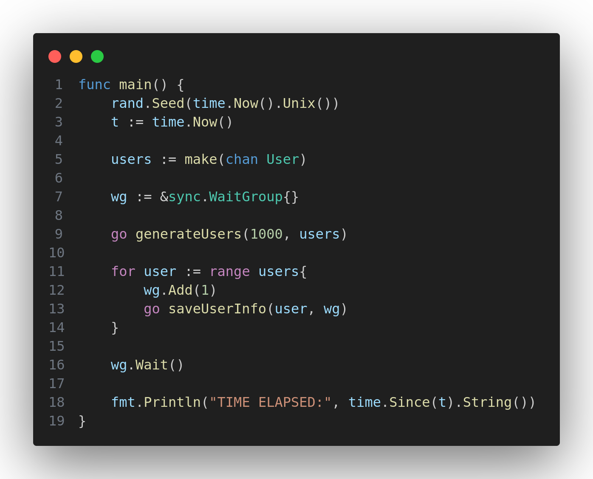

# Запись логов пользователей в файл
Программа производить асинхронную запись логов 1000 пользователей в файл.

За счет использование **goroutine** в программе - запись в файл происходит в **7х БЫСТРЕЕ** 
относительно линейной программы:
```go
before using the goroutine time: 14.778768872s
after using the goroutine, time: 2.482559738s.
```
## Характеристика ПК:
- **Processor** Intel(R) Core(TM) i7-1065G7 CPU @ 1.30GHz, 4 core
- **RAM** 16GB
- **OS** Ubuntu 22.04

## Технологии 
- Golang
- библиотеки: 
    - sync
- использование goroutine, chanel, wg

## Использование 
- Установите последнею версию **go**

- Запустите приложение  командой:

```go
    go run main.go
```

## Вывод в консоли
```
....
WRITING FILE FOR USER ID: 364
WRITING FILE FOR USER ID: 118
WRITING FILE FOR USER ID: 578
TIME ELAPSED: 2.482559738s
```


## Пример лог файла пользователя ```logs/uid_1.txt```
```
ID:3 | Email: user_email3@gmail.com
Activity Log:
1. [logged in] at 2024-07-03 16:15:13.271304665 +0300 MSK m=+0.000224188
2. [create record] at 2024-07-03 16:15:13.271304733 +0300 MSK m=+0.000224256
3. [logged out] at 2024-07-03 16:15:13.271304798 +0300 MSK m=+0.000224319
4. [logged in] at 2024-07-03 16:15:13.27130486 +0300 MSK m=+0.000224382
5. [delete record] at 2024-07-03 16:15:13.271304924 +0300 MSK m=+0.000224446
6. [logged out] at 2024-07-03 16:15:13.271304988 +0300 MSK m=+0.000224510
 ... 
61. [create record] at 2024-07-03 16:15:13.271308496 +0300 MSK m=+0.000228017

```

## Main
